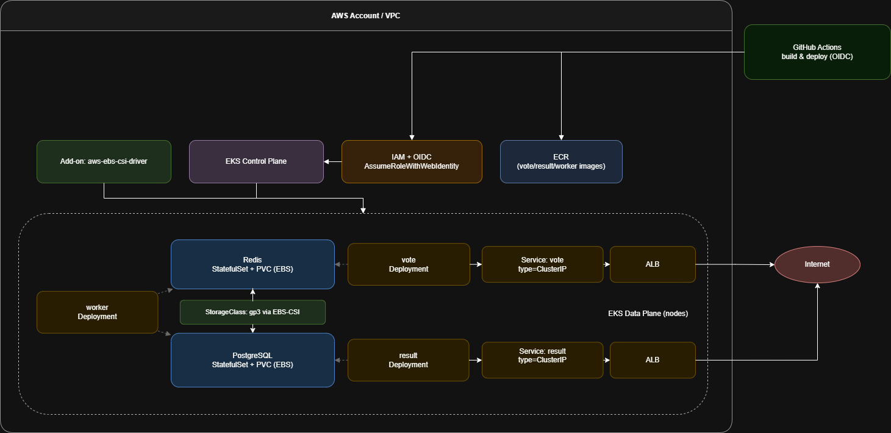
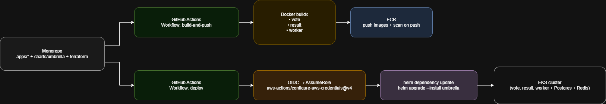

# TSTC01 Example Voting App on AWS EKS using Terraform, Helm & GitHub Actions

A production‑minded, minimal, and secure implementation of the classic **Example Voting App** on **Amazon EKS**, using **Terraform v1.6+**, **EKS module v21**, a **custom Helm umbrella chart** (apps + dependencies), and **GitHub Actions** with **OIDC** to assume AWS roles.

---

## Updates: Application Load Balancer (ALB) for WebSocket Support

The `vote` and `result` services now use **AWS Application Load Balancer (ALB)** instead of classic ELB. This change was made to better support **WebSocket connections**, which are critical for real-time updates in the voting app.

### Why ALB is Better for WebSockets

1. **Native WebSocket Support**: ALB natively supports WebSocket and HTTP/2 protocols, ensuring seamless real-time communication between the client and backend services.
2. **Idle Timeout Configuration**: ALB allows fine-grained control over idle timeout settings, which is essential for maintaining long-lived WebSocket connections. The timeout has been set to 3600 seconds for both services to prevent premature disconnections.
3. **Sticky Sessions**: ALB supports sticky sessions via target group attributes, which helps maintain session affinity for WebSocket connections, especially when fallback mechanisms like polling are used.
4. **Path-Based Routing**: ALB enables advanced routing capabilities, such as path-based or host-based routing, which can simplify future expansions (e.g., consolidating multiple services under a single ALB with different paths).
5. **Enhanced Observability**: ALB provides detailed metrics and logs for monitoring WebSocket traffic, making it easier to debug and optimize performance.

---

## TL;DR

```powershell
# 1) Configure AWS CLI profile (example)
$env:AWS_PROFILE = "TSTC01-Admin"
$env:AWS_REGION  = "us-east-1"

# 2) Deploy infra (VPC optional if using default, EKS, ECR, IAM, EBS-CSI, etc.)
cd terraform
terraform init
terraform apply -auto-approve

# 3) Update kubeconfig & grant your IAM principal (optional helper)
aws eks update-kubeconfig --name tstc01-voting-eks --region us-east-1

# 4) Build & push images (done by GitHub Actions in CI, or locally if needed)
# docker buildx build ./apps/vote -t <acct>.dkr.ecr.$env:AWS_REGION.amazonaws.com/vote:<tag> --push

# 5) Deploy umbrella chart
helm repo add bitnami https://charts.bitnami.com/bitnami
helm upgrade --install voting-app helm/voting-app -n default -f helm/voting-app/values.yaml

# 6) Get the public URLs (per‑service LBs chosen for simplicity)
kubectl get svc vote result -o wide

# 7) Destroy (cleanup)
terraform destroy -auto-approve
```

---

## Overview

**Goal.** Deploy a working sample voting application on AWS EKS with sane defaults, least‑privilege IAM, and a simple but robust CI/CD path. The app has three custom services (**vote**, **result**, **worker**) plus two standard stateful dependencies (**PostgreSQL** and **Redis**).

**Approach.**

* **Infrastructure as Code** via Terraform (EKS cluster + IAM + ECR + EBS CSI add‑on + tagging).
* **Kubernetes packaging** via a **custom Helm umbrella chart** bundling the three app services and declaring **Bitnami PostgreSQL** and **Bitnami Redis** as chart dependencies.
* **Images** built per service (vote, result, worker) and pushed to **ECR** with immutable version tags.
* **CI/CD** with **GitHub Actions OIDC** → short‑lived AWS credentials (no static secrets). One workflow builds/pushes images; another deploys Helm.
* **Storage**: **EBS (gp3) PersistentVolumes** through the **AWS EBS CSI** add‑on, rather than host‑local storage, as an example of real persistence on EKS.

This keeps the footprint small while following security & cost best practices.

---

## Architecture



**Why per‑service LoadBalancers?** Simplicity for the challenge. In production we’d use **AWS Load Balancer Controller + Ingress** (path‑based routing).

---

## Components

* **Terraform** (EKS module v21): cluster, managed node group, IRSA/Pod Identity, ECR repos, EBS CSI add‑on, default tags.
* **Helm umbrella chart**: custom chart that declares Bitnami sub‑charts for **PostgreSQL** and **Redis**, and templates for **vote**, **result**, **worker**.
* **PostgreSQL**: persistent storage using EBS PVs via CSI driver.
* **Redis**: single instance for cache / simple queue used by worker.
* **GitHub Actions**: two workflows

  * **Build & Push**: docker build each app → push to ECR with deterministic tags.
  * **Deploy**: assume AWS role via OIDC → helm upgrade --install umbrella chart.

---

## Design Decisions & Trade‑offs (Short Rationale)

* **Monorepo** for the challenge: infra + charts + app sources in one place ⇒ faster iteration & CI wiring. In production, split repos (infra, charts, each service).
* **Umbrella Helm chart**: single entry point with explicit dependency versions (Bitnami) for reproducible deployments, strong control via values.yaml.
* **EBS CSI** over local‑path: shows real persistence and AZ‑durability characteristics; slightly overkill for a demo but closer to production.
* **Per‑service Services of type LoadBalancer**: trivial public exposure. For prod I would use ALB + Ingress, TLS, WAF, and Route53 or external DNS.
* **Least‑privilege IAM**: one deploy role for GitHub; workload identities for CSI; no full admin roles.

---

## Prerequisites

* **AWS CLI v2**, **kubectl**, **Helm 3**, **Terraform ≥ 1.6**, **Docker**
* **PowerShell 7+** (Windows/macOS/Linux)
* An AWS account with permissions to provision EKS, IAM, ECR, and VPC/EBS.

Optional but recommended: **aws-vault** or **AWS SSO** for short‑lived credentials. Can work with static keys but not recommended.

---

## Repository Structure (Monorepo)

```text
.
├─ terraform/                   # EKS, IAM, ECR, EBS-CSI, tagging
│  ├─ main.tf
│  ├─ variables.tf
│  ├─ outputs.tf
│  └─ ...
├─ helm/
│  └─ voting-app/                 # Custom umbrella chart
│     ├─ Chart.yaml
│     ├─ values.yaml            # app images, env vars, DB/Redis settings
│     └─ templates/             # vote, result, worker, Services, etc.
├─ src/
│  ├─ vote/                     # Dockerfile, app source (patched for env)
│  ├─ result/
│  └─ worker/
└─ .github/workflows/
   └─ build-and-push.yml        # CI: builds all images → ECR
```

---

## Command to Grant the Current AWS CLI Identity Cluster‑Admin

> Temporary bootstrap access using the **Cluster Access Management API**. Adjust `PrincipalArn` to your IAM user/role. This will enable your identity to manage the cluster via `kubectl`. In production, use least‑privilege IAM and Kubernetes RBAC.

```powershell
# Permissions to the current identity to manage the cluster
$Cluster      = "tstc01-voting-eks"
$PrincipalArn = "arn:aws:iam::000000000000:user/TSTC01-Admin"

# Create access entry for your IAM user
aws eks create-access-entry `
  --cluster-name $Cluster `
  --principal-arn $PrincipalArn `
  --region us-east-1

# Associate cluster-admin policy (scope: entire cluster)
aws eks associate-access-policy `
  --cluster-name $Cluster `
  --principal-arn $PrincipalArn `
  --policy-arn arn:aws:eks::aws:cluster-access-policy/AmazonEKSClusterAdminPolicy `
  --access-scope type=cluster `
  --region us-east-1

# Update kubeconfig
aws eks update-kubeconfig --name $Cluster --region us-east-1
```

---

## Deployment Steps (PowerShell)

1. **Set AWS context**

```powershell
$env:AWS_PROFILE = "TSTC01-Admin"
$env:AWS_REGION  = "us-east-1"
```

2. **Provision infrastructure**

```powershell
cd terraform
terraform init
terraform apply -auto-approve
```

3. **Configure kubeconfig**

```powershell
aws eks update-kubeconfig --name tstc01-voting-eks --region us-east-1
kubectl get nodes -o wide
```

4. **(CI) Build & push images** – handled by GitHub Actions. For local testing:

```powershell
# Authenticate to ECR
$accountId = (aws sts get-caller-identity | jq -r '.Account')
aws ecr get-login-password | docker login --username AWS --password-stdin "$accountId.dkr.ecr.$env:AWS_REGION.amazonaws.com"

# Build & push each service (example tag)
$tag = "v0.1.0"
docker build ./src/vote   -t "$accountId.dkr.ecr.$env:AWS_REGION.amazonaws.com/vote:$tag"
docker push  "$accountId.dkr.ecr.$env:AWS_REGION.amazonaws.com/vote:$tag"
# Repeat for result & worker
```

5. **Deploy Helm umbrella chart**

```powershell
helm repo add bitnami https://charts.bitnami.com/bitnami
helm dependency update helm/voting-app
helm upgrade --install voting-app helm/voting-app -n default -f helm/voting-app/values.yaml
```

---

## Useful Commands (PowerShell)

```powershell
# K8s object overview
kubectl get all -n default

# App pods
kubectl get pods -l app=vote -o wide
kubectl get pods -l app=result -o wide
kubectl get pods -l app=worker -o wide

# Live logs
kubectl logs deploy/vote --tail=100 -f
kubectl logs deploy/result --tail=100 -f
kubectl logs deploy/worker --tail=100 -f

# Services and Load Balancers
kubectl get svc vote result -o wide

# Storage (verify PV/PVC via EBS CSI)
kubectl get sc
kubectl get pvc
kubectl get pv
```

---

## Setup of GitHub OIDC (No Static AWS Keys)

**Why**: eliminate long‑lived AWS keys in GitHub. Workflows request **id‑token** from GitHub and **AssumeRoleWithWebIdentity** in AWS.

**GitHub Actions workflow requirements**:

```yaml
permissions:
  id-token: write   # OIDC token
  contents: read

steps:
  - name: Configure AWS credentials
    uses: aws-actions/configure-aws-credentials@v4
    with:
      role-to-assume: arn:aws:iam::<ACCOUNT_ID>:role/github-deploy-role
      aws-region: us-east-1
```

---

## CI/CD via GitHub Actions

* **build-and-push.yml**

  * Triggers on push to main
  * `docker build` for **vote**, **result**, **worker**
  * Push to **ECR** with tags: `${{ github.sha }}`
  * Enable **image scanning on push** in ECR (configured in Terraform)

* **deploy.yml**

  * OIDC → assume `github-deploy-role`
  * `aws eks update-kubeconfig` for the target cluster
  * `helm dependency update` then `helm upgrade --install` umbrella chart
  * Values file injects built image tags for each service

Both workflows avoid storing AWS secrets, follow least privilege, and are idempotent.



---

## Validation & How to Get the Load Balancer URLs

```powershell
# Check pods are running
kubectl get pods -w

# Get their DNS names
$voteAlb   = kubectl get ing vote-ing   -o jsonpath='{.status.loadBalancer.ingress[0].hostname}'
$resultAlb = kubectl get ing result-ing -o jsonpath='{.status.loadBalancer.ingress[0].hostname}'
Write-Host "Vote ALB:   http://$voteAlb/"
Write-Host "Result ALB: http://$resultAlb/"

# Smoke tests
Invoke-WebRequest "http://$voteAlb/"   -UseBasicParsing | Select-Object StatusCode
Invoke-WebRequest "http://$resultAlb/" -UseBasicParsing | Select-Object StatusCode

# Open in browser
Start-Process "http://$voteAlb/"
Start-Process "http://$resultAlb/"
```
---

## Cleanup

```powershell
# Remove Helm release (optional)
helm uninstall voting -n default

# Destroy AWS resources provisioned by Terraform
cd terraform
terraform destroy -auto-approve
```


---

## Production Enhancements

**Networking & Ingress**

* Use **AWS Load Balancer Controller** + **Ingress** (path host‑based routing), **ACM** for TLS, **WAF** for Layer‑7 protection, **ExternalDNS** for Route 53.

**Data Stores**

* Migrate **PostgreSQL** to **Amazon RDS** (Multi‑AZ, backups, minor version automation).
* Migrate **Redis** to **Amazon ElastiCache** (or SQS/SNS for queues when appropriate).

**Secrets & Config**

* Replace K8s Secrets with **AWS Secrets Manager** / **Parameter Store** and **secret‑store‑csi‑driver**.

**Observability**

* **CloudWatch** (Container Insights), or **Prometheus + Grafana** with long‑term storage.
* Structured logs, app metrics, and alerting SLIs/SLOs.

**Security**

* Enforce **least privilege** IAM; enable **ECR image scanning**; use **OPA/Gatekeeper** or **Kyverno** policies.
* **NetworkPolicies** in K8s; restrict egress; use **IRSA/Pod Identity** for all cloud access.

**Reliability & Scale**

* **HPA** for deployments; **Cluster Autoscaler**; multiple AZ node groups.
* **Backup/Restore** for PVCs and RDS snapshots.

**Cost Controls**

* Tagging (already enabled), **budgets & alerts**, spot/OD mix where appropriate, right‑size node groups.

---

## Notes on App Patches

The original sample apps had hardcoded hosts/env usage. Each service (**vote**, **result**, **worker**) was patched to read configuration from **environment variables** provided by the umbrella chart. This keeps charts declarative and deploys reproducible.

---

## Security & Compliance at a Glance

* No static AWS keys in CI: **OIDC** + short‑lived credentials.
* **ECR scanning** on push; immutable tags by commit SHA.
* **Least privilege IAM** for deploy role and add‑ons; no blanket admin.
* **Kubernetes RBAC**: scoped service accounts per component.
* **Data at rest**: EBS volumes encrypted; KMS as needed.

---


## License

MIT (for the challenge scaffolding). The example application code retains its original license where applicable.
